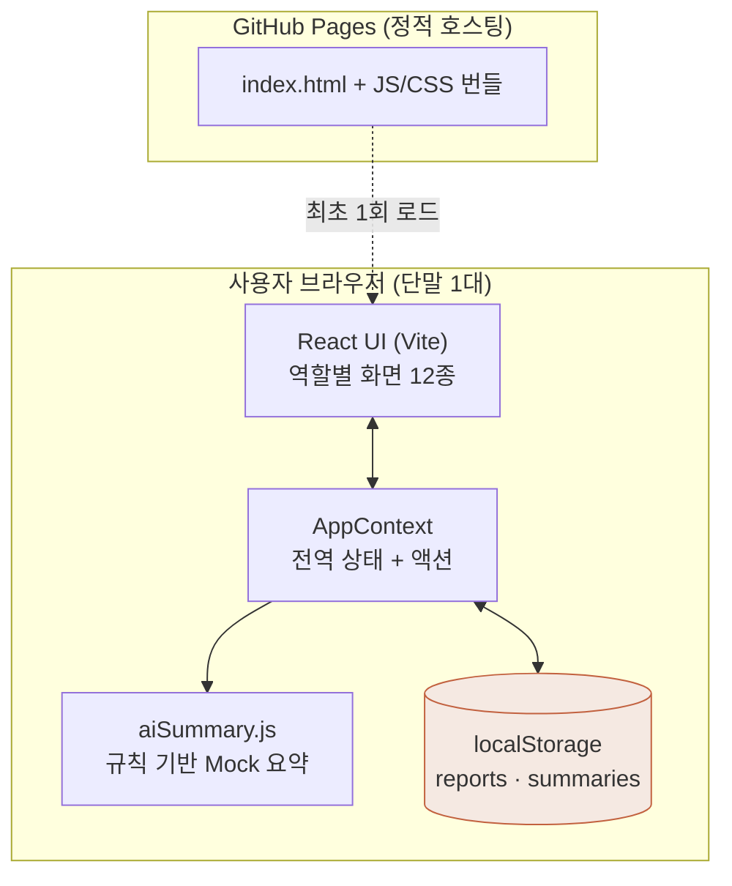
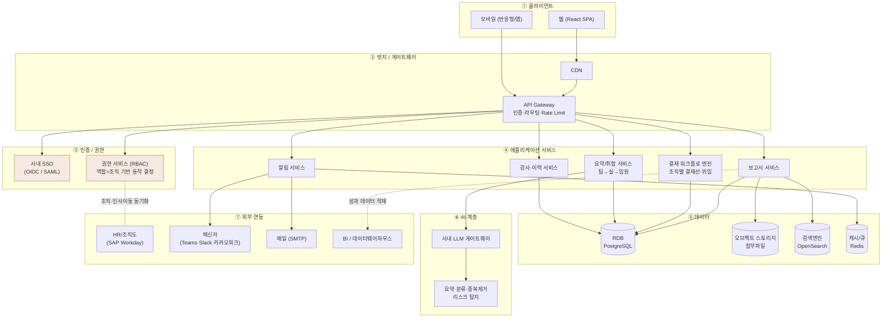
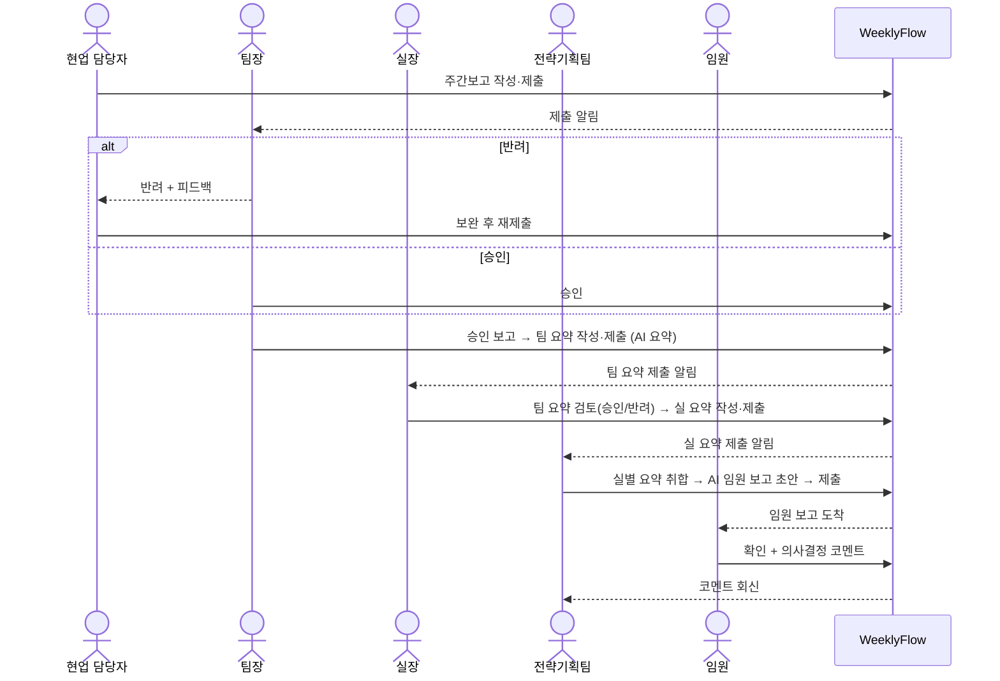
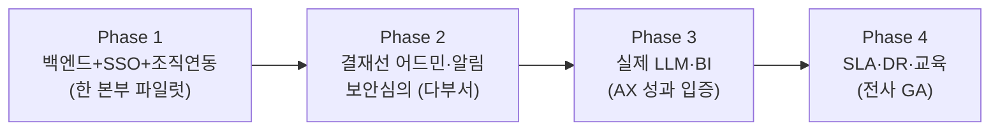

# WeeklyFlow 아키텍처 설계도

이 문서는 **현재 MVP(As-Is)** 와 **전사 포털 목표(To-Be)** 아키텍처, 결재 워크플로, 데이터 모델, 기술 스택을 정리합니다.
다이어그램은 Mermaid로 작성되어 GitHub에서 바로 렌더링됩니다.

---

## 1. 현재 MVP 아키텍처 (As-Is)

> 백엔드 없이 **브라우저 단독**으로 동작하는 프로토타입. 흐름·UX·데이터 모델 검증이 목적.



**한계:** 데이터가 단말의 localStorage에만 존재 → 팀장이 팀원 보고를 볼 수 없음. 인증·조직·AI 모두 가짜(Mock).

---

## 2. 전사 포털 목표 아키텍처 (To-Be)

> 계층형(Layered) 구조. **클라이언트 · 엣지 · 애플리케이션 · 데이터 · AI · 연동 · 인프라/보안** 7개 레이어.



### 레이어별 책임 요약

| 레이어 | 책임 | 대표 구성요소 |
|---|---|---|
| ① 클라이언트 | 화면·입력·시각화 | React SPA, 모바일 |
| ② 엣지/게이트웨이 | 분산·캐싱·인증 위임·트래픽 제어 | CDN, API Gateway |
| ③ 인증/권한 | 신원 확인, 역할 기반 접근통제 | SSO(OIDC/SAML), RBAC |
| ④ 애플리케이션 | 도메인 로직(보고·결재·요약·알림·감사) | 마이크로/모듈러 서비스 |
| ⑤ 데이터 | 영속·검색·캐시·파일 | PostgreSQL, OpenSearch, Redis, 오브젝트 스토리지 |
| ⑥ AI | 요약·분류·리스크 탐지(사내 보안 경유) | LLM 게이트웨이 |
| ⑦ 연동 | 조직도·알림·BI 연계 | HR, 메신저, 메일, DWH |

> **보안/컴플라이언스**는 전 레이어 횡단 관심사: 전송·저장 암호화, 감사로그, 개인정보(PII) 마스킹, 보존정책, ISMS/보안심의.

---

## 3. 결재 워크플로 (시퀀스)

> 현업 → 팀장 → 실장 → 전략기획팀 → 임원. 각 단계 승인/반려 + 단계별 자동 취합.



---

## 4. 데이터 모델 (ER 개요)

```mermaid
erDiagram
  USER ||--o{ WEEKLY_REPORT : writes
  USER ||--o{ FEEDBACK : writes
  WEEKLY_REPORT ||--o{ FEEDBACK : has
  WEEKLY_REPORT }o--|| TEAM_SUMMARY : "rolled into"
  TEAM_SUMMARY }o--|| OFFICE_SUMMARY : "rolled into"
  OFFICE_SUMMARY }o--|| EXEC_SUMMARY : "rolled into"
  EXEC_SUMMARY ||--o{ EXEC_COMMENT : has

  USER {
    id PK
    name
    role
    team
    office
    department
  }
  WEEKLY_REPORT {
    id PK
    week
    authorId FK
    team
    office
    title
    progress
    status
  }
  FEEDBACK {
    id PK
    reportId FK
    writerId FK
    action
    comment
  }
  TEAM_SUMMARY {
    id PK
    week
    team
    leadId FK
    status
  }
  OFFICE_SUMMARY {
    id PK
    week
    office
    managerId FK
    status
  }
  EXEC_SUMMARY {
    id PK
    week
    authorId FK
    status
  }
```

> 현재 MVP의 `src/data/mockData.js` 스키마가 그대로 테이블로 승격 가능합니다. 전사 전환 시 추가: 감사로그·버전 이력·첨부파일·조직 마스터(동기화) 테이블.

---

## 5. 기술 스택 제안

| 영역 | MVP(현재) | 전사(목표) |
|---|---|---|
| 프론트엔드 | React 18 + Vite | 동일 + 라우터·서버상태(React Query)·디자인시스템 |
| 백엔드 | 없음 | Node(NestJS) 또는 Spring Boot, REST/GraphQL |
| 인증 | Mock | 사내 SSO(OIDC/SAML), JWT, RBAC |
| DB | localStorage | PostgreSQL + Redis + OpenSearch |
| 파일 | 없음 | S3 호환 오브젝트 스토리지 |
| AI | 규칙 기반 Mock | 사내 LLM 게이트웨이(프라이빗) |
| 알림 | Mock | 메일 + Teams/Slack/카카오워크 |
| 배포 | GitHub Pages | 컨테이너(K8s)/사내 클라우드, CI/CD, 모니터링·DR |

---

## 6. 단계적 전환 로드맵



전략: **"파일럿 → 절감효과 수치 입증 → 확산"**. 처음부터 전사 오픈은 결재선 다양성·보안 리스크로 위험.
